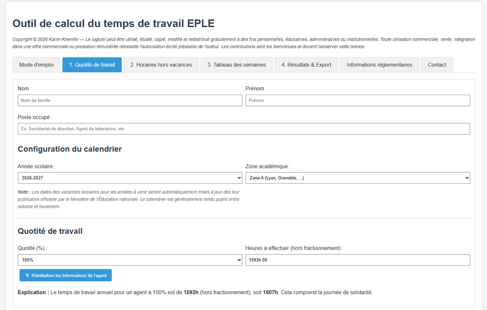
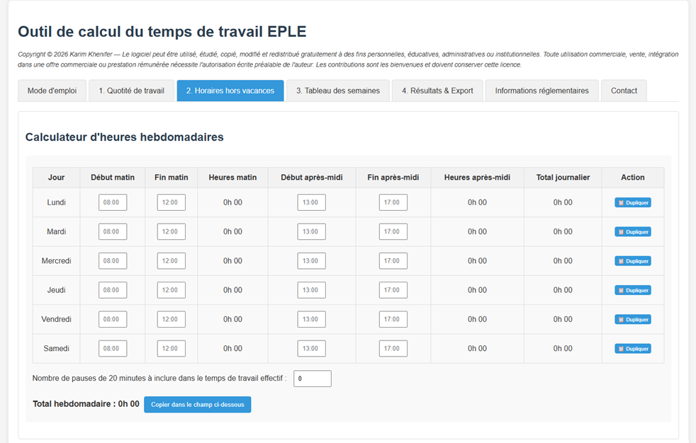
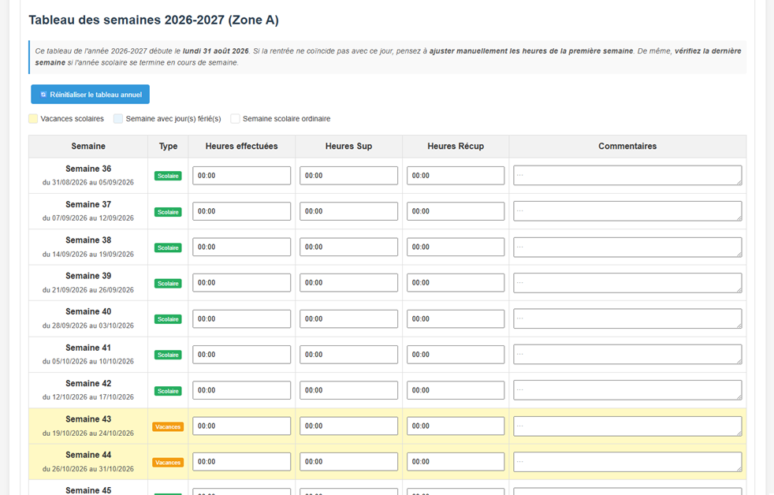
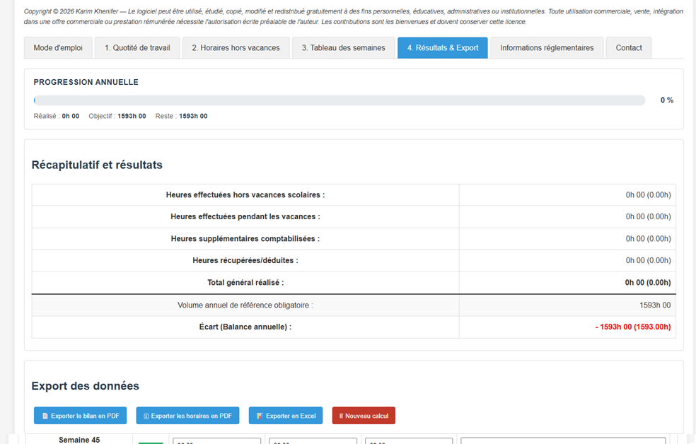

# TempoEPLE

Application web développée en HTML, CSS et JavaScript permettant de calculer le temps de travail annuel des personnels exerçant en EPLE (Établissements Publics Locaux d'Enseignement) et d'établir leurs emplois du temps.

Version en ligne :
https://karim-khfr.github.io/calculateur-edt-eple/

## Présentation

Cet outil a été conçu pour faciliter la gestion du temps de travail des agents sur l'année scolaire sélectionnée par l'utilisateur.

Il permet de calculer automatiquement les obligations de service en fonction de la quotité de travail, de suivre les heures effectuées semaine par semaine, de prendre en compte les heures supplémentaires et les récupérations, puis de générer un bilan annuel complet exportable au format PDF.

## Pourquoi ce projet ?

Les personnels administratifs et ITRF des EPLE doivent concevoir des emplois du temps respectant des contraintes réglementaires complexes.

Cet outil a été développé pour faciliter ce travail en automatisant les calculs annuels, le suivi hebdomadaire et la génération de documents exploitables.

## Limitations

- nécessite une connexion Internet pour récupérer le calendrier officiel lors du premier chargement ;
- ne remplace pas la validation par le chef d'établissement ;
- les dates des vacances scolaires dépendent des données publiées par le ministère.

## Fonctionnalités

### Mode d'emploi intégré

* Guide d'utilisation complet directement accessible dans l'application.
* Export du guide au format PDF.

### Quotité de travail

* Saisie du nom, du prénom et du poste occupé par l'agent.
* Sélection de l'année scolaire (2026-2027, 2027-2028, 2028-2029).
* Sélection de la zone académique (Zone A, B ou C).
* Calcul automatique du calendrier scolaire via l'API officielle du Ministère de l'Éducation nationale.
* Calcul automatique du volume annuel à effectuer en fonction de la quotité de travail.
* Gestion des quotités de 40 % à 100 %.
* Affichage du volume de référence en heures et minutes (sans arrondi).



### Horaires hebdomadaires

* Calculateur d'horaires hebdomadaires par demi-journée (matin et après-midi).
* Saisie libre au format HH:MM.
* Duplication rapide des horaires d'un jour vers d'autres jours.
* Calcul automatique des temps de travail journaliers et hebdomadaires.
* Prise en compte des pauses de 20 minutes dans les cas où elles doivent être comptabilisées comme temps de travail effectif.
* Report automatique du total hebdomadaire vers le tableau annuel.
* Bouton de réinitialisation des horaires hebdomadaires.



### Tableau annuel des semaines

* Tableau complet des semaines de l'année scolaire, généré dynamiquement.
* Identification visuelle des semaines de vacances scolaires (fond jaune).
* Chargement automatique des dates de vacances depuis l'API officielle du Ministère de l'Éducation nationale.
* Pré-remplissage automatique des semaines travaillées à partir des horaires hebdomadaires saisis.
* Saisie des heures hebdomadaires au format HH:MM ou décimal.
* Gestion des heures supplémentaires.
* Gestion des heures récupérées.
* Ajout de commentaires personnalisés.
* Bouton de réinitialisation du tableau annuel.



### Bilan annuel

* Calcul en temps réel :

  * des heures effectuées hors vacances scolaires ;
  * des heures effectuées pendant les vacances scolaires ;
  * des heures supplémentaires ;
  * des heures récupérées ;
  * du total général ;
  * de l'écart entre le temps dû et le temps effectué (affiché en vert ou en rouge).



### Export PDF du bilan

Génération automatique d'un document récapitulatif comprenant :

1. Les informations de l'agent (nom, prénom, quotité, volume annuel de référence) ;
2. Le tableau des horaires hebdomadaires saisis ;
3. Le récapitulatif complet des semaines de l'année (avec distinction Scolaire / Vacances) ;
4. Les résultats annuels (total réalisé, référence, écart) ;
5. Un bloc de signatures (agent et supérieur hiérarchique).

### Sauvegarde automatique

Toutes les données sont enregistrées automatiquement dans le navigateur grâce au LocalStorage.

Aucune saisie n'est perdue lors de la fermeture ou du rechargement de la page.

### Réinitialisation

Quatre niveaux de réinitialisation indépendants :

* Réinitialisation des informations de l'agent (onglet 1).
* Réinitialisation des horaires hebdomadaires (onglet 2).
* Réinitialisation du tableau annuel (onglet 3).
* Nouveau calcul complet (efface toutes les données).

### Informations réglementaires

* Rappel des principales références réglementaires relatives au temps de travail en EPLE.
* Règles générales d'organisation du temps de travail.
* Valorisation des heures travaillées en horaires décalés ou atypiques.
* Décompte des jours fériés.

## Structure du projet

```
/
├── index.html
├── css/
│   └── style.css
└── js/
    └── app.js
```

## Technologies utilisées

### Front-end

* HTML5
* CSS3
* JavaScript (Vanilla JS)

### Bibliothèques

* [jsPDF](https://github.com/parallax/jsPDF)
* [jsPDF AutoTable](https://github.com/simonbengtsson/jsPDF-AutoTable)
* SheetJS (xlsx) (génération des exports Excel)

### Services externes

* API Données ouvertes du Ministère de l'Éducation nationale (calendrier scolaire)
* API française des jours fériés (calcul automatique des jours fériés)

### Stockage

* LocalStorage (sauvegarde automatique des données dans le navigateur)

## Public concerné

Cet outil s'adresse principalement :

* aux personnels de direction d'EPLE ;
* aux secrétaires généraux d'EPLE ;
* aux personnels administratifs des EPLE;
* aux personnels ITRF exerçant en EPLE.

## Utilisation

1. Télécharger ou cloner le dépôt.
2. Ouvrir le fichier `index.html` dans un navigateur web moderne.
3. Renseigner les différents onglets dans l'ordre proposé.

Aucune installation ni serveur web ne sont nécessaires. Une connexion Internet est nécessaire au premier chargement pour récupérer le calendrier scolaire officiel depuis l'API du Ministère de l'Éducation nationale.

## État du projet

> Ce projet est fonctionnel et activement maintenu. Il peut encore évoluer en fonction des besoins exprimés par les utilisateurs.

## Signaler un problème

Vous pouvez utiliser les Issues GitHub ou le formulaire de contact intégré dans l'application.

## Licence

Ce logiciel est distribué selon les conditions définies dans le fichier `LICENSE`.

© 2026 Karim Khenifer.